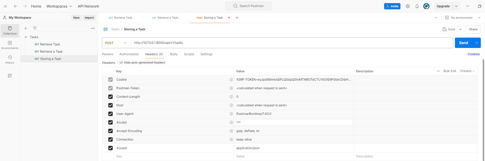

```env
DB_CONNECTION=mysql
DB_HOST=127.0.0.1
DB_PORT=3306
DB_DATABASE=laravel_api
DB_USERNAME=root
DB_PASSWORD=
```

```bash
php artisan make:model
What should the model be named?
Task
seed, factory, requests, migration, policy, resource
```

##### create_tasks_table migration

```php
public function up(): void {
        Schema::create('tasks', function (Blueprint $table) {
            $table->id();
            $table->string('name');
            $table->boolean('is_completed')->default(false);
            $table->timestamps();
        });
    }
```

##### TaskFactory

```php
class TaskFactory extends Factory {
    /**
     * Define the model's default state.
     *
     * @return array<string, mixed>
     */
    public function definition(): array {
        return [
            'name' => fake()->sentence(),
            'is_completed' => rand(0, 1),

        ];
    }
}
```

#### DatabaseSeeder

```php
<?php

namespace Database\Seeders;

// use Illuminate\Database\Console\Seeds\WithoutModelEvents;
use App\Models\Task;
use Illuminate\Database\Seeder;

class DatabaseSeeder extends Seeder {
    /**
     * Seed the application's database.
     */
    public function run(): void {
        // \App\Models\User::factory(10)->create();

        // \App\Models\User::factory()->create([
        //     'name' => 'Test User',
        //     'email' => 'test@example.com',
        // ]);

        Task::factory(10)->create();
    }
}
```

```php
php artisan migrate --seed
```

##### TaskController

go to App\Http\Controllers make Api\V1 Folders cut TaskController.php paste here in V1 ফোল্ডার
Correct the namespace use App\Http\Controllers\Api\V1\TaskController;

```php
<?php

namespace App\Http\Controllers\Api\V1;

use App\Http\Controllers\Controller;
use App\Http\Requests\StoreTaskRequest;
use App\Http\Requests\UpdateTaskRequest;
use App\Models\Task;

class TaskController extends Controller {
    /**
     * Display a listing of the resource.
     */
    public function index() {
        return Task::all();
}
```

##### api.php

```php
use App\Http\Controllers\Api\V1\TaskController;
Route::prefix('v1')->group(function () {
    Route::apiResource('/tasks', TaskController::class);
});
```

to chech route list:
// php artisan route:list --path=api

Let's now access the tasks index endpoint in our client tools postman. Let I me create a new collection name it Task inside the task collection let's add a new request name it Retrieve Task. The http verb will beget. url will be http://127.0.0.1:8000/api/v1/tasks.

### Now we'll learn about eloquent API resources. As the name suggests, eloquent API resource is useful when building API.So it's basically a mechanism to transform your eloquent model into JSON responses.It acts as a transformation layer between your eloquent models and the JSON responses that are returned to your applications users.

All right, let's open up our terminal. Then to create an API resource we can call. `PHP artisan make:resource`.Let's call a task resource `PHP artisan make:resource TaskResource`. Let's open up the file inside the resources folder. Then in the two array method declaration `return parent::toArray($request);`.Let's return an array. And define which attributes that will be exposed. In this case, I'd.From the task ID.And then name.From the task name.And then is completed.

```php
return [
            'id' => $this->id,
            'name' => $this->name,
            'is_completed' => $this->is_completed,
        ];
```

From the task is completed.Next. Let's head back to the task controller.Then instead of returning an eloquent collection like this `return Task::all();`.Now we'll return the task resource .Since we'll return a collection of tasks.We call the collection method.Then pass the collection in `return TaskResource::collection(Task::all());`.Don't forget to import the task resource namespace `use App\Http\Resources\TaskResource;`. Now, while we're here, let's go to the show method.Inside the method, we'll return a single resource.So we call the task resource.Since we'll return a single task we call the make method.And passing the task instance.

```php
public function show(Task $task) {
        return TaskResource::make($task);
}
```

All right, let's give it a save.Back to Postman.Then hit the send button.Now we see our task collection wrapped in a data array.And each task only contains ID name and is completed.Now for the is completed attribute.Let's go back to the task resource.And cast is complete adds value to a boolean `'is_completed' => (bool) $this->is_completed,`. Hit the send button again. It's now in a boolean value.Okay, let's give this a save.Then duplicate the request.Let's change the name to retrieve a task.Then we need to specify the task ID here.Then my case, it's going to be one`http://127.0.0.1:8000/api/v1/tasks/1`.Hit the send button.And here I get back a single task.

we'll create another API endpoint that allows users to persist data to avoid unwanteddata.We also validate the incoming request to meet our requirements.Let's switch over to our editor.Then go to the requests folder.Here.Let's open the store task request. In the authorized method. Let's return.True, since we don't want to perform any authorization.

```php
public function authorize(): bool {
        return true;
}
```

Next in the rules method.Let's define validation rules for the name column. It's going to be required.String.And maximum character.2.55.Okay, that's it for now.

```php
public function rules(): array {
        return [
            'name' => 'required|string|max:255',
        ];
    }
```

Let's now go to the task controller.Since we're building API, we don't need to define the create method.So let's get rid of that.

```php
//delete it
/**
     * Show the form for creating a new resource.
     */
    public function create() {
        //
    }
```

Then here in the store method.

```php
public function store(StoreTaskRequest $request) {
        //
}

```

Let's remove the redirect response if exist like this `(StoreTaskRequest $request): RedirectResponse`.

Return type.Inside the method.Let's call the task model.Then save the incoming requests by calling the Create method.And then pass in the validated request data.

```php
public function store(StoreTaskRequest $request) {
        Task::create($request->validated());
    }
```

The Create method will return a model instance. We can assign it to a variable `$task = Task::create($request->validated());`.

After that, we can return the newly created task as a JSON response. So let's copy the code from the show method .Now, since we use the create method we need to mass assignable the column.

```php
 public function store(StoreTaskRequest $request) {
        $task = Task::create($request->validated());
        return TaskResource::make($task);
    }
```

So let's go to the task model.Then specify the mass assignable column in the fillable attribute.

```php
class Task extends Model {
    use HasFactory;
    protected $fillable = ['name'];

}
```

Let's give it a safe.Back to Postman.Duplicate this request.Change the name.To storing a task.The http verb will be post.The URL will be API version one tasks.`http://127.0.0.1:8000/api/v1/tasks` Then in the header we need to add except key.While the value will be application JSON. 

Next Let's go to the body.Choose the raw option. And the format will be JSON format. For now, we'll send an empty object `{}` to see if the validation is working as expected. Hit the send button.Okay, here we get a 4 to 2 unprocessable content error, which is the error that we expect.And here the error message, the name field is required. Now let's enter the name here.

```JSON
{
    "name": "Task one"
}
```

Then hit the send button again. Okay.The task has been created.And we'll get back the newly created task.
